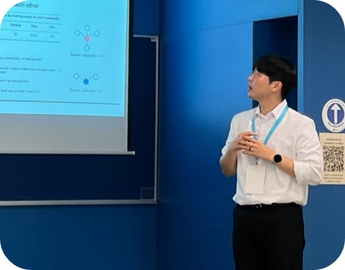

### Seunghyun Lee

*"Transform raw data into intelligence"*

- Currently working toward an integrated Ph.D. in Industrial Engineering @Konkuk University
- A member of [Business Intelligence and Data Analytics Laboratory @Konkuk University](https://sites.google.com/view/kkbizintelligence/lab-home?authuser=0)

#### Education

- Ph.D. student, Department of Industrial Engineering, Konkuk University (2021.03 ~ Current)
- B.S. degree, Department of Industrial Engineering, Konkuk University (2015.03 ~ 2021.02)

#### Research Interest

- Social & Patent data analytics for social problem-solving R&D
- Natural language processing for business intelligence
- Machine learning-based prediction/decision systems
- Data-driven prognostics and health management

#### Paper

***Submitted***

- Predicting potential social issues by learning a context entity network
- Mitigating uncertainty in machine learning-based technology valuation: A calibration approach

***International***

- **Lee, S.**, Lee, J., Lee, J. M., Chun, H. W., & Yoon, J†. (2025). Linking social media data and patents via Wikipedia for social problem-solving R&D. Computers & Industrial Engineering, 111039. ([Link](https://www.sciencedirect.com/science/article/pii/S0360835225001858))
- Hong, J., Seol, Y., **Lee, S.**, Yoon, J.†, Lee, J., Park, K. S., & Ha, J. W. (2024). Prediction of Cognitive Impairment Using Sleep Lifelog Data and LSTM Model. Mathematics, 12(20), 3208. ([Link](https://www.mdpi.com/2227-7390/12/20/3208))
- Park, S., Jeon, B., **Lee, S.**, & Yoon, J†. (2024). Multi-Label Emotion Recognition of Korean Speech Data Using Deep Fusion Models. Applied Sciences, 14(17), 7604. ([Link](https://www.mdpi.com/2076-3417/14/17/7604))
- Seol, Y., **Lee, S.**, Lee, J., Kim, C. W., Bak, H. S., Byun, Y., & Yoon, J†. (2024). An Interpretable Time Series Forecasting Model for Predicting NOx Emission Concentration in Ferroalloy Electric Arc Furnace Plants. Mathematics, 12(6), 878. ([Link](https://www.mdpi.com/2227-7390/12/6/878))
- Lee, J., **Lee, S.**, Kim, C. H., & Yoon, J†. (2023). Technology-transferability analysis of universities and public research institutes using deep neural networks. IEEE Access, 11, 135196-135211. ([Link](https://ieeexplore.ieee.org/abstract/document/10335185))
- Seol, Y., **Lee, S.**, Kim, C., Yoon, J.†, & Choi, J†. (2023). Towards firm-specific technology opportunities: A rule-based machine learning approach to technology portfolio analysis. Journal of Informetrics, 17(4), 101464. ([Link](https://www.sciencedirect.com/science/article/pii/S1751157723000895))
- **Lee, S.**, Lee, J., Lee, J. M., Chun, H. W., & Yoon, J†. (2023). A Network Analysis Approach to Detecting Social Issues with Web-Based Data. Applied Sciences, 13(14), 8516. ([Link](https://www.mdpi.com/2076-3417/13/14/8516))
- **Lee, S.**, Lee, S., Lee, K., Lee, S., Chung, J., Kim, C. W., & Yoon, J†. (2021). Data-driven health condition and RUL prognosis for liquid filtration systems. Journal of Mechanical Science and Technology, 35, 1597-1607. ([Link](https://link.springer.com/article/10.1007/s12206-021-0323-8))

***Domestic***

- 김민규, 설영진, **이승현**, & 윤장혁†. (2025) 특허의 Problem-Solution 분석을 활용한 반도체 기술 동향분석 (Problem-Solution based Patent Analysis for Identifying Semiconductor Technology Trends), 지식재산연구, 20(1), 145-175. ([Link](https://www.kci.go.kr/kciportal/ci/sereArticleSearch/ciSereArtiView.kci?sereArticleSearchBean.artiId=ART003184635))
- **이승현**, 이지호, 박서인, 이재민, 전홍우, & 윤장혁†. (2024). 특허의 Problem-Solution 정보를 활용한 대규모 언어모델 기반 R&D 솔루션 분석 방법 (Large Language Model-based R&D Solution Analysis Approach Using Problem-Solution Information of Patents). 지식재산연구, 19(3), 155-180. ([Link](https://www.kci.go.kr/kciportal/ci/sereArticleSearch/ciSereArtiView.kci?sereArticleSearchBean.artiId=ART003118399))
- 박서인, 이지호, **이승현**, 윤장혁†, & 손창호. (2023). 제품 및 서비스 개선을 위한 기술기회 발굴: 특허와 상표 데이터 활용 (Enhancing Existing Products and Services Through the Discovery of Applicable Technology: Use of Patents and Trademarks). 산업경영시스템학회지, 46(4), 1-14. ([Link](https://www.kci.go.kr/kciportal/ci/sereArticleSearch/ciSereArtiView.kci?sereArticleSearchBean.artiId=ART003031521))
- 이지호, **이승현**, 손은수, 윤장혁†, & 이재민†. (2023). 해석가능 인공지능을 활용한 바이오화학 기술의 비즈니스 잠재성 평가 (Evaluating the Business Potential of Bio-based Chemical Technologies Using Explainable AI). 대한산업공학회지, 49(3), 223-236. ([Link](https://www.dbpia.co.kr/journal/articleDetail?nodeId=NODE11435015))
- **이승현**, 최재웅, & 윤장혁†. (2021). 제품 출시 초기의 고객 불만 모니터링을 위한 소셜미디어 마이닝 접근법 (A Social Media Mining Approach for Monitoring Customer Complaints in the Early Stage of Product Launch). 대한산업공학회지, 47(3), 289-301. ([Link](https://www.dbpia.co.kr/journal/articleDetail?nodeId=NODE10566184))
- 김명섭, 최재은, 민희식, **이승현**, 이종민, & 윤장혁†. (2020). 온라인 데이터 마이닝을 활용한 서울지역 호텔의 외국인 고객 이용 만족도 요인 파악 및 경영 전략 도출 (Identifying Determinants of Foreign Guests’ Satisfaction and Management Strategies for Hotels in Seoul Using Online Data Mining). 고객만족경영연구, 22(1), 1-24. ([Link](https://kiss.kstudy.com/Detail/Ar?key=3771309))

#### Conference

- **Lee, S.**, Lee, J., Lee, J. M., Chun, H. W., & Yoon, J. (2023). Developing an R&D solutions generation model using problem-solution patterns of patents. APIEMS, Kuala Lumpur

- Seol, Y., **Lee, S.**, Lee, J., Yoon, J., Kim, C. W., Byun, Y., Bak, H.S. (2023). An interpretable time series forecasting model for predicting Nox emission concentration in alloy steel electric furnace plants. APIEMS, Kuala Lumpur
- **Lee, S.**, Lee, J., Lee, J. M., Chun, H. W., & Yoon, J. (2023). A network analysis-based approach for detecting issues in society with web-based data. R&D Management Conference, Seville
- **이승현**, 이지호, 이재민, 전홍우, & 윤장혁. (2023). 웹 기반 데이터를 활용한 네트워크 분석 기반의 사회이슈 탐지 접근법. 대한산업공학회 춘계학술대회, 신화월드, 제주
- 설영진, **이승현**, 이지호, 변영철, 박현수, & 윤장혁. (2023). 해석가능한 딥러닝 기반 시계열 예측 모형을 활용한 합금철 전기로 사업장의 NOx 배출 농도 예측. 대한산업공학회 춘계학술대회, 신화월드, 제주
- 홍준희, **이승현**, 이지호, & 윤장혁. (2023). 특허소송 예측 및 위험도 분석을 위한 머신러닝 기반의 접근법. 대한산업공학회 춘계학술대회, 신화월드, 제주
- 박서인, 이지호, **이승현**, & 윤장혁. (2023). 제품 및 서비스 개선을 위한 가용기술 도출: 특허와 상표 데이터 활용. 대한산업공학회 춘계학술대회, 신화월드, 제주
- **이승현**, 이지호, 최재웅, & 윤장혁. (2022). 사회이슈 탐지를 위한 네트워크 구조 분석 기반의 접근법. 대한산업공학회 춘계학술대회, 라마다프라자호텔, 제주
- 이지호, **이승현**, 박서인, & 윤장혁. (2022). 연구기관 보유기술의 거래가능성 평가모형 개발: 특허 권리거래 데이터의 활용. 대한산업공학회 춘계학술대회, 라마다프라자호텔, 제주
- 설영진, **이승현**, 최재웅, 이희윤, & 윤장혁. (2022). 특허의 요소기술 결합패턴 분석을 통한 기술기회 발굴. 대한산업공학회 춘계학술대회, 라마다프라자호텔, 제주
- **이승현**, 최재웅, & 윤장혁. (2021). 딥러닝 기반의 장기 존속 특허 분류 모델. 대한산업공학회 춘계학술대회, ICC, 제주

#### Project

- **2024.05~2024.12**, 생애 전주기 비대면 의사소통장애 재활 플랫폼 개발 (Development of a non-face-to-face platform for life-cycle communication disorder rehabilitation), 중소기업기술정보진흥원, Researcher
- **2024.04~2024.10**, 사회이슈 분석을 통한 소셜트윈 기반 잠재이슈 예측모형 연구 (Development of social twin based potential issue prediction model  through social issuue analysis), 한국과학기술정보연구원, Researcher
- **2023.04~2024.09**, 사회문제 해결방안 패턴 추출모형 연구 (Development of a solution pattern extraction model for social problems), 한국과학기술정보연구원, Researcher
- **2022.09~2025.05**, 음성발화데이터: 인지, 언어, 운동 기능의 건강관리부터 질병 예측까지 (Speech data predicting the health and diseases of cognitive, language and motor functions), 한국연구재단, Researcher
- **2022.06~2025.02**, 다중계층데이터의 지능적 분석 및 결합을 통한 비즈니스 기회발굴을 위한 통합 자동화 모델 개발 (Development of an integrated model for business opportunity discovery through intelligent analysis and combination of multi-layer data), 한국연구재단, Researcher
- **2022.04~2024.12**, 합금철 전기로 사업장의 NOx/미세먼지 동시저감 및 스마트 운전 기술 개발 (Simultaneous removal of NOx/fine dust and smart operation of electric furnace in ferroalloy plant), 한국환경산업기술원, Researcher
- **2022.04~2022.10**, 사회이슈와 R&D Solution 연계 프로세스 개발 (Social issue and R&D solution linking process development), 한국과학기술정보연구원, Researcher
- **2021.03~2024.02**, 이종 데이터의 지능적 연결 및 기술 솔루션 생성모형을 통한 소셜 이슈 대응 비즈니스 발굴 체계 (Social issue-corresponding business discovery framework based on intelligent linkage of heterogeneous data sources and technical solution generation models), 한국연구재단, Researcher
- **2021.01~2023.12**, 중개연구 기술seed 발굴 시스템 활용 및 확산모델 개발 (Utilization and diffusion model for system finding the technology seed with translation research), 과학기술일자리진흥원, Researcher
- **2018.06~2021.05**, 소셜-기술 데이터 애널리틱스 기반의 비즈니스 발굴-평가-운영 체계 (Social-technical data analytics-based business intelligence for business discovery, evaluation and operation), 한국연구재단, Researcher

#### Patent

- 윤장혁, 홍준희, 설영진, **이승현**, 이지호. 수면 데이터를 이용한 인공지능 기반의 인지장애 예측 장치 및 방법 (APPARATUS AND METHOD FOR PREDICTING COGNITIVE IMPAIRMENT BASED ON ARTIFICIAL INTELLIGENCE USING SLEEP DATA). 출원번호: 10-2024-0193846. 대한민국특허청.
- 윤장혁, 박서인, **이승현**, 전병훈. 음성 데이터에 대한 다중 레이블 감정 인식 장치 및 방법 (APPARATUS AND METHOD FOR MULTI-LABEL EMOTION RECOGNITION FOR VOICE DATA). 출원번호: 10-2024-0177387. 대한민국특허청.

#### Prize

- **이승현**, 김만수, 이상원, 이승주, & 장재후. (2019). 미래 자동차산업의 고객 니즈 파악을 위한 LDA 토픽모델링 기반의 미약 신호 탐지, 우수상, 제 17회 대학생 프로젝트 경진대회, 한국산업경영시스템학회

#### Link

- [Google Scholar](https://scholar.google.co.kr/citations?user=mOqXJDgAAAAJ&hl=ko)
- [Business Intelligence and Data Analytics Laboratory](https://sites.google.com/view/kkbizintelligence/lab-home?authuser=0)
